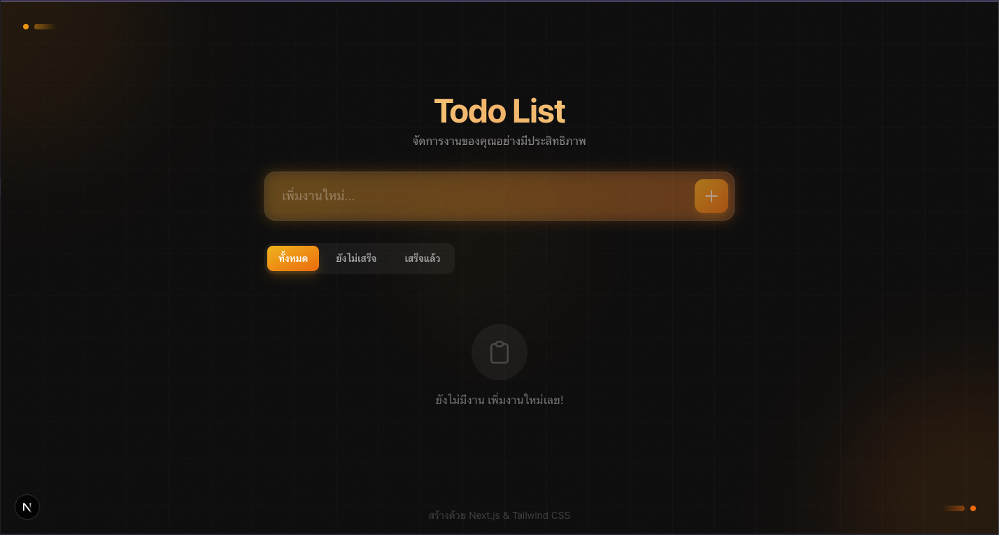

# 📚 แบบฝึกหัด: สร้าง Todo List ด้วย React + Next.js

## 🎯 เป้าหมาย

เรียนรู้การสร้าง Todo List Application ตั้งแต่เริ่มต้น ครอบคลุม:

- ✅ TypeScript Types & Interfaces
- ✅ React Hooks (useState, useEffect)
- ✅ State Management
- ✅ CRUD Operations (Create, Read, Update, Delete)
- ✅ localStorage Persistence
- ✅ Conditional Rendering
- ✅ Event Handling

---

## 📋 ภาพรวมโปรเจค



### Features ที่ต้องสร้าง:

1. **เพิ่ม Todo** - พิมพ์ข้อความแล้วกดปุ่ม + หรือ Enter
2. **Toggle สถานะ** - คลิก checkbox เพื่อเปลี่ยนสถานะ เสร็จ/ไม่เสร็จ
3. **ลบ Todo** - คลิกไอคอนถังขยะ
4. **แก้ไข Todo** - Double-click เพื่อแก้ไขข้อความ
5. **Filter** - กรองดู ทั้งหมด / ยังไม่เสร็จ / เสร็จแล้ว
6. **ล้างที่เสร็จแล้ว** - ลบ todos ที่เสร็จทั้งหมด
7. **บันทึกข้อมูล** - เก็บข้อมูลใน localStorage

---

## 🗂️ ไฟล์ที่ต้องแก้ไข

```
src/
├── types/
│   └── todo.ts           # 📝 Exercise 1: สร้าง Types
└── components/
    ├── TodoList.tsx      # 📝 Exercise 2: สร้าง Main Component
    └── TodoItem.tsx      # 📝 Exercise 3: สร้าง Item Component
```

---

## 📝 Exercise 1: สร้าง Types (`src/types/todo.ts`)

### เป้าหมาย

เรียนรู้การสร้าง TypeScript Interface และ Type

### สิ่งที่ต้องทำ

1. สร้าง `Todo` interface ที่มี properties:
   - `id` - string
   - `text` - string
   - `completed` - boolean
   - `createdAt` - Date

2. สร้าง `FilterType` type:
   - `"all"` | `"active"` | `"completed"`

---

## 📝 Exercise 2: สร้าง TodoList Component (`src/components/TodoList.tsx`)

### เป้าหมาย

เรียนรู้ State Management, useEffect, CRUD operations

### สิ่งที่ต้องทำ

| TODO | สิ่งที่ต้องทำ |
|------|-------------|
| 1 | สร้าง 4 states (todos, inputValue, filter, isLoaded) |
| 2 | useEffect โหลดข้อมูลจาก localStorage |
| 3 | useEffect บันทึกข้อมูลลง localStorage |
| 4 | Function addTodo |
| 5 | Function toggleTodo |
| 6 | Function deleteTodo |
| 7 | Function editTodo |
| 8 | Function clearCompleted |
| 9 | Computed values (filteredTodos, activeCount, completedCount) |

---

## 📝 Exercise 3: สร้าง TodoItem Component (`src/components/TodoItem.tsx`)

### เป้าหมาย

เรียนรู้ Props, Local State, Event Handling

### สิ่งที่ต้องทำ

| TODO | สิ่งที่ต้องทำ |
|------|-------------|
| 1 | สร้าง Props Interface |
| 2 | สร้าง Local States (isEditing, editText) |
| 3 | Function handleSubmit |
| 4 | Function handleKeyDown |

---

## ✅ วิธีทดสอบ

1. รัน development server:
   ```bash
   npm run dev
   ```

2. เปิด browser ไปที่ http://localhost:3000

3. ทดสอบ features:
   - [ ] เพิ่ม todo ได้
   - [ ] Toggle สถานะได้
   - [ ] ลบ todo ได้
   - [ ] Double-click แก้ไขได้
   - [ ] Filter ทำงานถูกต้อง
   - [ ] Refresh หน้าแล้วข้อมูลยังอยู่

---

## 📖 เฉลย

ดูเฉลยได้ที่โฟลเดอร์ `exam/solutions/`

**⚠️ คำแนะนำ**: พยายามทำด้วยตัวเองก่อน! ถ้าติดขัดค่อยดู Hints ในไฟล์ ถ้ายังไม่ได้ค่อยดูเฉลย

---

## 🆘 ติดปัญหา?

### Error: "Cannot find module '@/types/todo'"
→ ตรวจสอบว่าไฟล์ `types/todo.ts` export ถูกต้อง

### Error: "localStorage is not defined"
→ ใช้ `"use client"` ที่บรรทัดแรกของ component

### Todo ไม่แสดง
→ ตรวจสอบว่า `filteredTodos.map()` return JSX ถูกต้อง

### ข้อมูลหายเมื่อ refresh
→ ตรวจสอบ useEffect ที่บันทึกลง localStorage

---

## 🎉 เสร็จแล้ว!

ยินดีด้วย! คุณได้เรียนรู้:

- ✅ TypeScript Types & Interfaces
- ✅ React State Management
- ✅ useEffect Hook
- ✅ CRUD Operations
- ✅ localStorage
- ✅ Conditional Rendering
- ✅ Event Handling

**Next Steps**: ลองเพิ่ม features เช่น drag & drop, due date, categories!
